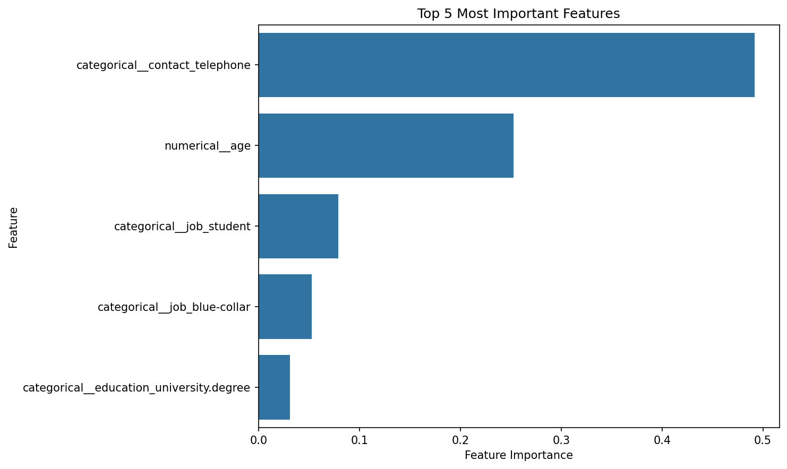
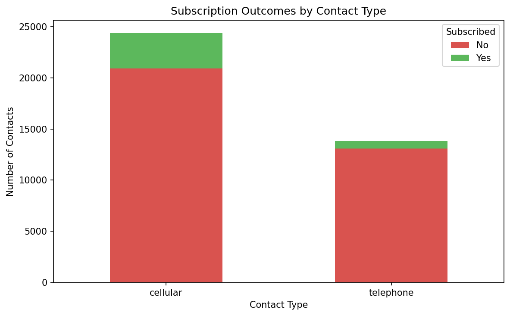
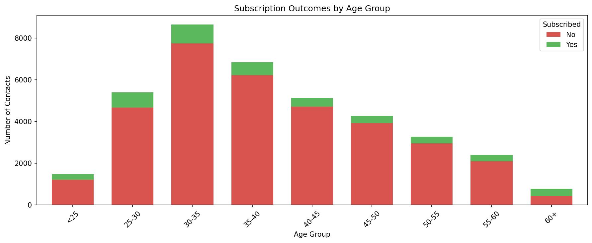

# Bank Direct Marketing Campaign

## Background

A Portuguese bank conducted a marketing campaign to sell potential customers on long-term deposit subscriptions with good interest rates.  The campaign was conducted over telephone, which had a high time and money cost.  This analysis attempts to use data collected from the campaign to build a predictive model that can be used to target those individuals that have a high likelihood of subscribing without spending resources marketing to those individuals with a low likelihood of subscribing.

## Data

The dataset contains 41,188 records and 20 features spanning client demographics, marketing attempts, and social and economic context attributes.  The target variable is whether the client subscribed to the long-term deposit offer.  The data is imbalanced with only approximately 11% of clients subscribing.

## Modeling

Four classification models were evaluated:
- Logistic Regression
- K-Nearest Neighbors
- Decision Tree
- Support Vector Machine

The primary evaluation metric was ROC-AUC, which measures a model's ability to distinguish between classes.  In other words, how good the model is at assigning higher probabilities to customers who subscribe than to those who do not.  This metric was chosen over simple accuracy because a model that always predicts "no" would have 89% accuracy while being completely useless for the business goal.

| Model | ROC-AUC | Best Threshold | Precision | Recall | F1 | Train Time |
|---|---|---|---|---|---|---|
| Logistic Regression | 0.673 | 0.577 | 0.200 | 0.448 | 0.276 | 3.66s |
| KNN | 0.663 | 0.150 | 0.182 | 0.519 | 0.270 | 228.8s |
| **Decision Tree** | **0.685** | **0.558** | **0.194** | **0.563** | **0.289** | **4.903s** |
| SVM | 0.672 | 0.102 | 0.182 | 0.580 | 0.278 | 325.27s |

The best performing model was the Decision Tree.  It had the highest ROC-AUC (0.685) and F1 score (0.289) at a reasonable training time.  It provides a precision of 19.4%.  

## Findings

### The two most important features in predicting subscription were:

#### 1. Contact type
Clients contacted via cellular were almost 3 times more likely to subscribe than those who were contacted by telephone.  This could be because people are likely able to answer their cell phone anytime the marketing attempt is made.  Conversely, an attempt via landline suffers in that the intended recipient could be away and miss the marketing attempt entirely. 

| Contact Type | Success Rate (%) |
|---|---|
| cellular | 14.5 |
| telephone | 5.2 |

#### 2. Age
Customers older than 60 were much more likely to subscribe to the offer.  This could be because they generally have more assets to use for a potential investment opportunity. Customers younger than 25 also were also statistically more likely to subscribe to the offer.  In general, the subscription rate has a parabolic relationship with the subscription rate.

| Age Group | Success Rate (%) |
|---|---|
| <25 | 19.0 |
| 25-30 | 13.5 |
| 30-35 | 10.6 |
| 35-40 | 8.8 |
| 40-45 | 8.0 |
| 45-50 | 8.2 |
| 50-55 | 9.7 |
| 55-60 | 12.3 |
| 60+ | 44.9 |

The month that the contact was made was initially the most important feature in the Decision Tree model. However, months with high subscription rates (March, September, October, December) also had significantly fewer contacts, which increased variance and made that feature unreliable. Removing month as a feature produced a model that was more generalizable to future marketing campaigns.

## Recommendations

Using the provided model in future marketing campaigns will result in a higher success rate.  **By targetting only customers that this model predicts will subscribe to the offer, the bank would have a success rate closer to 19.4% which is 77% better than the 11% they experienced before modeling.**  If this model isn't used, the general recommendation is to target the campaign towards those over 60 years old using cellular contact information.

## Next Steps

- Include social and economic features like employment rate and consumer price index as they may result in a stronger model (they were excluded from this analysis per assignment instructions).
- Use stronger modeling methods like Random Forest and Gradient Boosting.

## Reference

